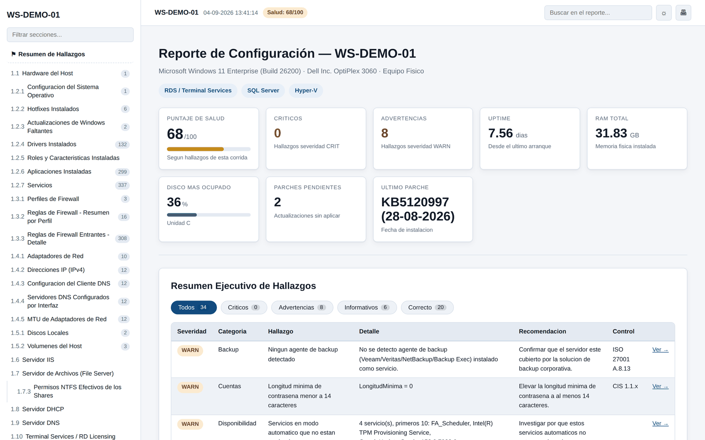
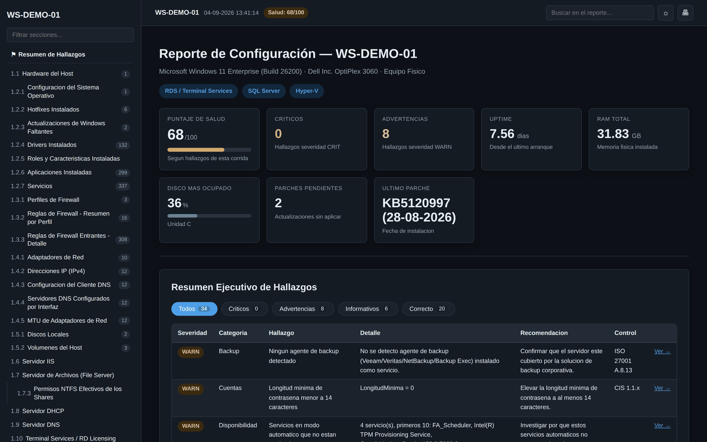

**Español** · [English](README.en.md)

# Get-ServerFullReport

**Inventario as-built y health check de servidores Windows en un solo `.ps1`.**

[](https://learn.microsoft.com/powershell/)
[](#requisitos)
[](LICENSE)
[](#seguridad)
[](#requisitos)

Levanta **104 secciones** de configuración de un servidor o equipo Windows, las analiza con **60 reglas** mapeadas a controles CIS e ISO 27001, y entrega un reporte HTML navegable con un resumen ejecutivo de hallazgos arriba. Sirve tanto para documentar (as-built formal, anexo de auditoría) como para revisar (qué está mal hoy en este servidor).

Un solo archivo. Sin módulos externos, sin instalación, sin conexión a internet. Copiar y ejecutar.

<p align="center">
  
</p>

<details>
<summary>Ver en tema oscuro</summary>
<p align="center">
  
</p>
</details>

> **[Ver un reporte de ejemplo completo](docs/reporte-ejemplo.html)** — descárgalo y ábrelo en el navegador (GitHub no renderiza HTML embebido).

---

## Índice

- [Por qué](#por-qué)
- [Qué hace](#qué-hace)
- [Instalación](#instalación)
- [Uso](#uso)
- [Parámetros](#parámetros)
- [Qué recolecta](#qué-recolecta)
- [El motor de hallazgos](#el-motor-de-hallazgos)
- [Comparación contra baseline (drift)](#comparación-contra-baseline-drift)
- [Modo flota](#modo-flota)
- [Formatos de salida](#formatos-de-salida)
- [Requisitos](#requisitos)
- [Seguridad](#seguridad)
- [Problemas conocidos](#problemas-conocidos)
- [Contribuir](#contribuir)
- [Licencia](#licencia)

---

## Por qué

`msinfo32` exporta hardware y drivers, y nada más: no trae software instalado, servicios, roles, configuración de IIS o DHCP, cuentas privilegiadas ni estado de seguridad. Los inventarios comerciales cuestan y hay que desplegarlos. Y cuando llega una auditoría, o alguien pregunta "¿qué tenía este servidor antes del cambio?", la respuesta suele ser una planilla desactualizada.

Este script cubre ese hueco: un archivo que se copia al servidor, se ejecuta, y deja un documento completo y una lista de lo que hay que arreglar.

## Qué hace

- **104 secciones** con detección automática de roles: si el equipo no tiene IIS, la sección lo dice explícitamente en vez de quedar vacía.
- **Resumen ejecutivo arriba de todo**: puntaje de salud, tarjetas KPI y una tabla de hallazgos por severidad, cada uno con su evidencia, la acción recomendada, el control CIS/ISO que aplica y un link a la sección que lo originó.
- **Un OK solo se emite si la regla realmente pudo evaluar el dato.** Si la sección no existe, el rol no está o la consulta falló, el tópico se calla. Afirmar que algo está bien sin haberlo verificado es peor que no decir nada.
- **HTML autocontenido**: TOC lateral generado automáticamente, buscador global, tablas ordenables y filtrables, tema claro/oscuro y CSS de impresión para el anexo firmado. Sin CDNs ni recursos externos.
- **Salida en JSON, CSV y Markdown** además del HTML, con hash SHA256 para valer como evidencia.
- **Comparación contra una ejecución anterior**: qué software, servicios, puertos, reglas de firewall y cuentas cambiaron.
- **Modo flota**: corre contra decenas de servidores en paralelo y genera un índice consolidado.
- **Solo lectura**: no modifica absolutamente nada en el equipo auditado.

## Instalación

No hay instalación. Descarga el archivo y ejecútalo:

```powershell
# Opción 1: clonar
git clone https://github.com/KikeMuller/Get-ServerFullReport.git
cd Get-ServerFullReport

# Opción 2: bajar solo el script
Invoke-WebRequest -Uri 'https://raw.githubusercontent.com/KikeMuller/Get-ServerFullReport/main/Get-ServerFullReport.ps1' -OutFile 'Get-ServerFullReport.ps1'
```

Si lo descargaste por navegador, Windows le pone la marca de "archivo de internet" y no lo va a ejecutar:

```powershell
Unblock-File .\Get-ServerFullReport.ps1
```

En entornos con la política de ejecución restringida, la forma menos invasiva es habilitarla solo para la sesión actual:

```powershell
Set-ExecutionPolicy -ExecutionPolicy Bypass -Scope Process -Force
```

Para uso recurrente en producción, lo correcto es **firmar el script** con un certificado de firma de código de la organización y distribuirlo desde un repositorio interno.

## Uso

```powershell
# Equipo local. Genera HTML + JSON en la carpeta del script.
.\Get-ServerFullReport.ps1

# Un servidor remoto, con todos los formatos
.\Get-ServerFullReport.ps1 -ComputerName SRV-APP-01 -OutputPath D:\AsBuilt -Format HTML,JSON,CSV,Markdown

# Barrido rápido de seguridad y cuentas sobre varios equipos
.\Get-ServerFullReport.ps1 -ComputerName SRV01,SRV02,SRV03 -Sections 1.11,1.14 -ThrottleLimit 8

# Comparar contra el levantamiento del mes pasado
.\Get-ServerFullReport.ps1 -BaselinePath D:\AsBuilt\AsBuilt_SRV-APP-01_20260804_090000.json

# Versión compartible: enmascara IPs, cuentas, rutas, seriales y thumbprints
.\Get-ServerFullReport.ps1 -Redact

# Todo, incluido lo lento
.\Get-ServerFullReport.ps1 -IncludeMissingUpdates -PerfSampleSeconds 60 -ScanGitRepos -EventLogDays 14
```

### Como tarea programada

```powershell
$accion  = New-ScheduledTaskAction -Execute 'powershell.exe' `
    -Argument '-NoProfile -ExecutionPolicy Bypass -File "C:\Scripts\Get-ServerFullReport.ps1" -OutputPath "\\fs01\AsBuilt" -Quiet'
$trigger = New-ScheduledTaskTrigger -Weekly -DaysOfWeek Sunday -At 3am
$conf    = New-ScheduledTaskPrincipal -UserId 'SYSTEM' -LogonType ServiceAccount -RunLevel Highest

Register-ScheduledTask -TaskName 'AsBuilt semanal' -Action $accion -Trigger $trigger -Principal $conf
```

El script devuelve un código de salida útil para encadenar: `0` todo bien, `1` hubo errores de recolección, `2` el equipo estaba inalcanzable.

## Parámetros

| Parámetro | Tipo | Default | Descripción |
|---|---|---|---|
| `-ComputerName` | `string[]` | equipo local | Uno o varios equipos. Con más de uno se activa el modo flota. |
| `-OutputPath` | `string` | carpeta del script | Dónde escribir los reportes. |
| `-Format` | `string[]` | `HTML,JSON` | `HTML`, `JSON`, `CSV`, `Markdown`. Acepta lista separada por coma. |
| `-Sections` | `string[]` | todas | Prefijos a incluir, ej. `1.5,1.11`. |
| `-SkipSections` | `string[]` | ninguna | Prefijos a omitir. Útil para saltear lo lento. |
| `-BaselinePath` | `string` | — | JSON de una ejecución anterior. Agrega la sección de cambios. |
| `-Redact` | `switch` | off | Enmascara IPs, cuentas, rutas, seriales y thumbprints. |
| `-ThrottleLimit` | `int` | `8` | Equipos en paralelo en modo flota. |
| `-Credential` | `pscredential` | — | Credenciales para los equipos remotos. |
| `-PamBrokerEndpoint` | `string` | — | `host:puerto` del broker PAM. Sin esto no se prueba conectividad. |
| `-IncludeMissingUpdates` | `switch` | off | Consulta actualizaciones faltantes. Lenta: puede tardar minutos. |
| `-EventLogDays` | `int` | `7` | Ventana del análisis del registro de eventos. |
| `-PerfSampleSeconds` | `int` | `0` | Segundos de muestreo de rendimiento. `0` lo omite. |
| `-ScanGitRepos` | `switch` | off | Busca repositorios Git. Lenta en discos grandes. |
| `-GitScanPaths` | `string[]` | rutas típicas | Dónde buscar venv y repos. |
| `-Quiet` | `switch` | off | Sin salida por consola. Para tareas programadas. |

`Get-Help .\Get-ServerFullReport.ps1 -Full` tiene la ayuda completa con ejemplos.

## Qué recolecta

<details>
<summary><b>1.1 – 1.5 · Base del equipo</b></summary>

Hardware y número de serie · configuración del SO, zona horaria y rol en el dominio · hotfixes instalados y actualizaciones faltantes · drivers · roles y características · aplicaciones instaladas · servicios con ruta del binario y detección de *unquoted service path* · perfiles y reglas de firewall con puertos y direcciones · adaptadores, IPs, DNS, MTU, puertos en escucha con proceso dueño, rutas persistentes, archivo hosts y proxy · discos, volúmenes, BitLocker, deduplicación y cuotas FSRM.
</details>

<details>
<summary><b>1.6 – 1.10 · Roles de servidor</b> (solo si están instalados)</summary>

IIS: application pools, sitios y binding · File Server: shares, permisos SMB y **ACLs NTFS efectivas** marcando permisos riesgosos · DHCP: scopes, reservas, opciones y estadísticas · DNS: zonas, registros, forwarders y scavenging · Terminal Services / RD Licensing con historial de accesos RDP de los últimos 90 días.
</details>

<details>
<summary><b>1.11 · Seguridad y cumplimiento</b></summary>

Certificados con CN, vencimiento y clave privada · protocolos, cifrados y hashes SChannel · agente PAM · NTP · tareas programadas con nivel de privilegio · antivirus y EDR · reinicio pendiente · backups · hardening del SO (SMBv1, firma SMB, UAC, NLA, LLMNR, NetBIOS) · TPM, Secure Boot, Device Guard y Credential Guard · LAPS · activación y licenciamiento · autoridades raíz sospechosas.
</details>

<details>
<summary><b>1.12 – 1.14 · Directorio y accesos</b></summary>

WSUS · GPOs aplicadas (RSOP) · cuentas de servicio privilegiadas · miembros del grupo Administradores locales resueltos por SID · usuarios locales con vigencia de contraseña · grupo Remote Desktop Users · política de contraseñas y bloqueo · política de auditoría (`auditpol`) · derechos de usuario sensibles (`secedit`).
</details>

<details>
<summary><b>1.15 – 1.17 · Plataforma, desarrollo y salud</b></summary>

Intérpretes Python, paquetes pip, venv, conda y repositorios Git · dominio y ubicación en AD, replicación si es DC · capa de virtualización y versión de VMware Tools · VMs si es host Hyper-V · instancias SQL Server · DFS · impresoras compartidas · clúster · NIC teaming · iSCSI/MPIO · configuración de WinRM · uptime y archivo de paginación · apagados inesperados · errores críticos del registro de eventos agrupados por ID · baseline de rendimiento · top de procesos · salud SMART de los discos.
</details>

El inventario completo de secciones, con el nombre exacto de cada columna, está en [`docs/INVENTARIO_SECCIONES.md`](docs/INVENTARIO_SECCIONES.md).

## El motor de hallazgos

60 reglas agrupadas en 34 tópicos de cumplimiento. Cada hallazgo lleva severidad, evidencia concreta, acción recomendada, control CIS/ISO 27001 y un link a la sección que lo originó.

| Severidad | Significado |
|---|---|
| **CRIT** | Requiere acción inmediata: certificado expirado, disco por llenarse, SMBv1 habilitado, sin antivirus. |
| **WARN** | Desvío que hay que planificar: parches atrasados, cuentas sin expiración de contraseña, volumen sin cifrar. |
| **INFO** | Observación para documentar, no un defecto. |
| **OK** | Verificado y correcto. |

El puntaje de salud parte de 100 y descuenta 12 por cada CRIT y 4 por cada WARN. Los INFO no descuentan.

**El principio que gobierna todo el motor:** ninguna regla emite un hallazgo — ni negativo ni positivo — sobre un dato que no pudo leer. Si el valor viene como `N/D` o "No se pudo determinar", el tópico queda en silencio. Un "OK" falso es peor que el silencio, porque el sysadmin confía en él.

## Comparación contra baseline (drift)

```powershell
.\Get-ServerFullReport.ps1 -BaselinePath D:\AsBuilt\AsBuilt_SRV-APP-01_20260801.json
```

Agrega una sección con lo que cambió desde ese JSON: software, servicios, puertos en escucha, reglas de firewall, cuentas administrativas, certificados y tareas programadas. Ignora automáticamente lo que varía por naturaleza (uptime, espacio libre, contadores).

**Una cuenta nueva en el grupo Administradores locales se reporta como CRIT.**

Es lo que convierte el script en una herramienta de gestión de cambios: guarda el JSON de cada ejecución y la siguiente te dice qué pasó en el medio.

## Modo flota

```powershell
$servidores = (Get-ADComputer -Filter { OperatingSystem -like '*Server*' }).Name
.\Get-ServerFullReport.ps1 -ComputerName $servidores -OutputPath \\fs01\AsBuilt -ThrottleLimit 12
```

Corre en paralelo (runspaces en PS 5.1, `ForEach-Object -Parallel` si detecta PS 7) y produce:

- `_flota_index.html` — matriz de todo el parque, ordenable por puntaje de salud
- `_flota_hallazgos.csv` — todos los hallazgos de todos los equipos, para tabla dinámica
- `_flota_inalcanzables.csv` — equipos apagados, sin WinRM o fuera del dominio (que por sí solo ya es un hallazgo)

## Formatos de salida

| Formato | Para qué |
|---|---|
| **HTML** | El as-built navegable. Autocontenido, imprimible como anexo de auditoría. |
| **JSON** | Baselines, consolidación de flota, carga a un CMDB. UTF-8 sin BOM, fechas ISO 8601, con hash SHA256. |
| **CSV** | Un archivo por sección, para Excel y tablas dinámicas. |
| **Markdown** | Para pegar en Confluence, SharePoint o una wiki. |

## Requisitos

- **PowerShell 5.1 o superior.** Nada que instalar: viene con Windows Server 2016+ y Windows 10/11. Si hay PS 7 lo aprovecha para el paralelismo.
- **Ejecutar como Administrador.** Sin eso las secciones 1.11, 1.14 y parte de 1.5 quedan incompletas; el script avisa y sigue.
- **Para equipos remotos**: WinRM habilitado y el puerto 5985/5986 alcanzable, con permisos de administrador en el destino.

Probado en Windows Server 2016, 2019, 2022 y Windows 10/11.

## Seguridad

**El script no modifica nada** en el equipo auditado: solo consulta. No usa `Set-`, `New-`, `Remove-`, `Start-` ni `Stop-` sobre el sistema.

**El reporte contiene información sensible**: cuentas de servicio, direcciones IP internas, nombres de shares, thumbprints de certificados, puertos en escucha. Trátalo con el mismo cuidado que a cualquier documento de arquitectura:

- Guárdalo en un share con ACL restringida, no lo mandes por correo.
- Usa `-Redact` para las versiones que salen del equipo de infraestructura.
- La contraseña de `-Credential` nunca se escribe al JSON; la cuenta se registra enmascarada si ejecutas con `-Redact`.

Cada reporte incluye metadatos de auditoría (quién lo generó, desde qué equipo, versión del script) y el hash SHA256 del archivo.

## Problemas conocidos

- La heurística de BitLocker para detectar equipos portátiles usa `TipoSistema`, que rara vez lo indica bien. En notebooks conviene revisar la sección 1.5.3 a mano.
- El baseline de rendimiento (1.17.4) depende de nombres de contador localizados. Hay fallback por índice, pero en SOs con idiomas poco comunes puede devolver un mensaje en vez de datos.
- El encabezado repetido al imprimir usa `position:fixed`, que se repite por página en navegadores basados en Chromium (Edge, Chrome) pero no está garantizado en todos.
- El puntaje de salud satura en 0 cuando hay muchos críticos, así que no discrimina bien entre "mal" y "muy mal".

## Contribuir

Los reportes de bugs y los pull requests son bienvenidos. Ver [CONTRIBUTING.md](CONTRIBUTING.md).

**Si vas a reportar un bug, adjunta el JSON de la ejecución** (con `-Redact` si tiene datos sensibles). Contiene todo lo recolectado más el log de ejecución embebido, que es lo que permite reproducir el problema sin acceso a tu equipo.

## Licencia

[MIT](LICENSE) — © 2026 Enrique Müller.

Se entrega tal cual, sin garantía. Es una herramienta de solo lectura, pero pruébala en un equipo de laboratorio antes de ejecutarla masivamente en producción.
